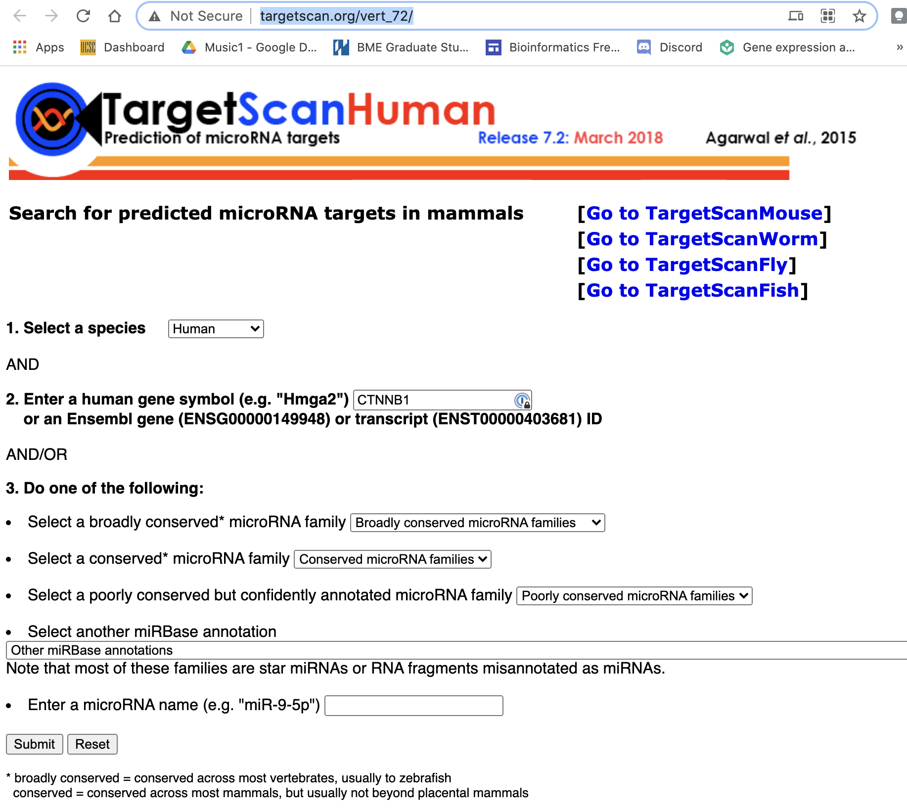
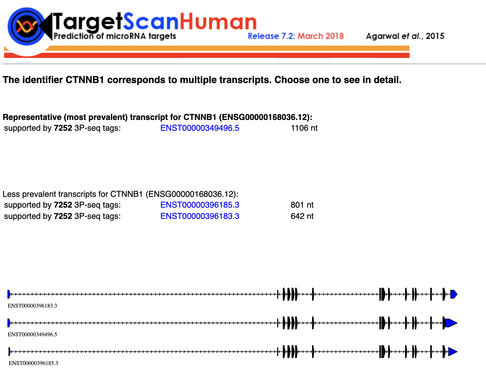
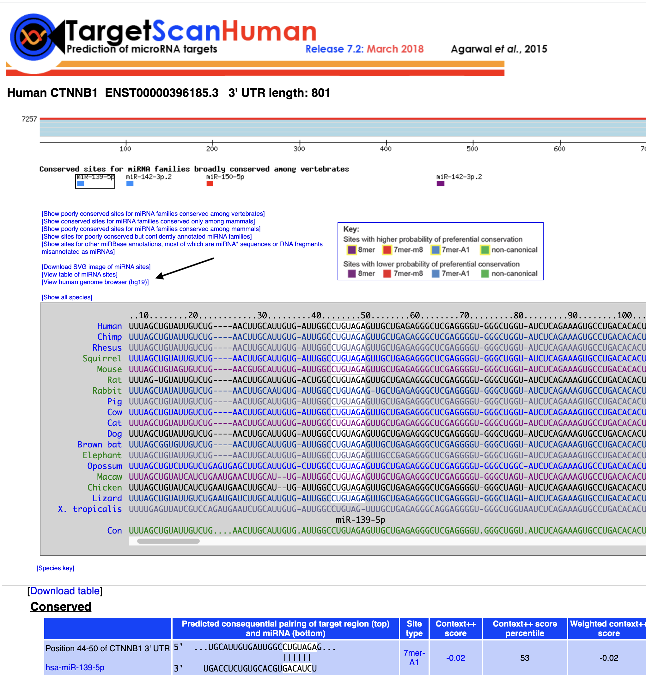
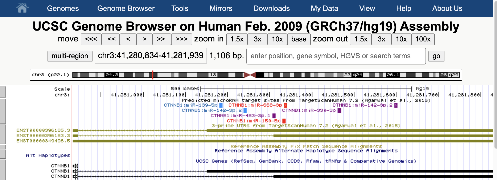
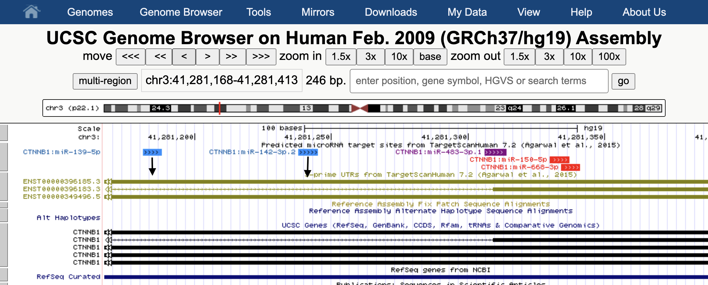
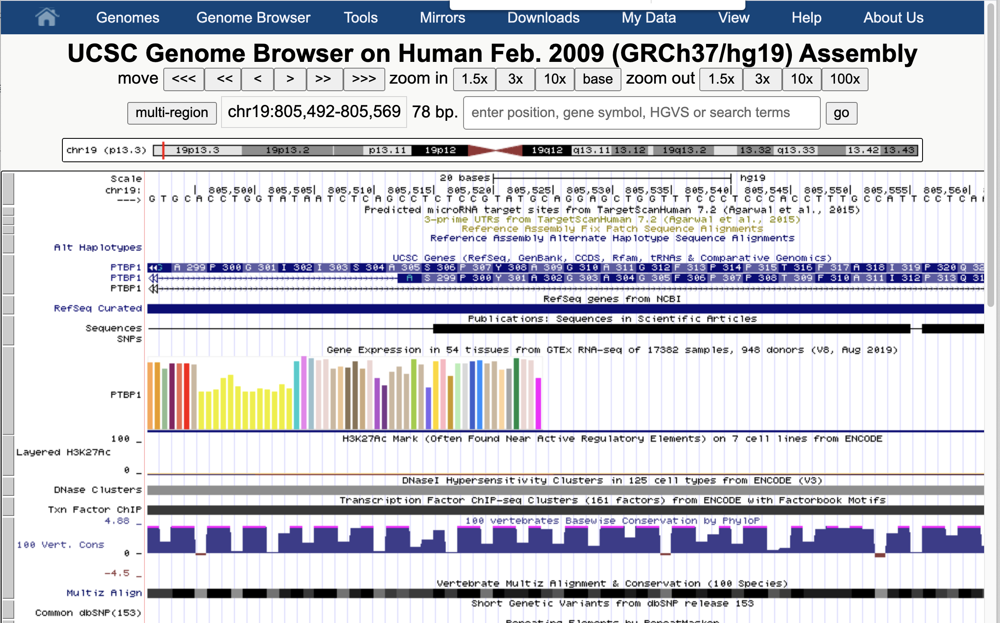
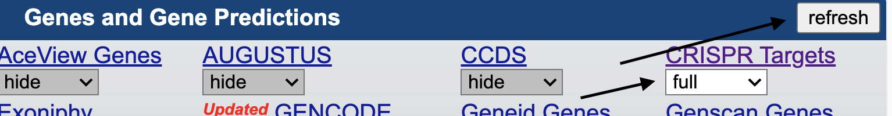
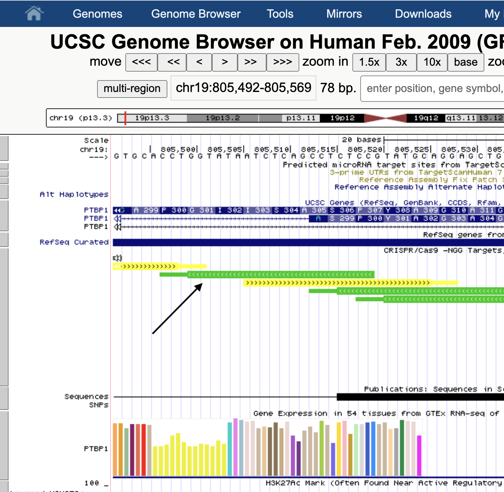
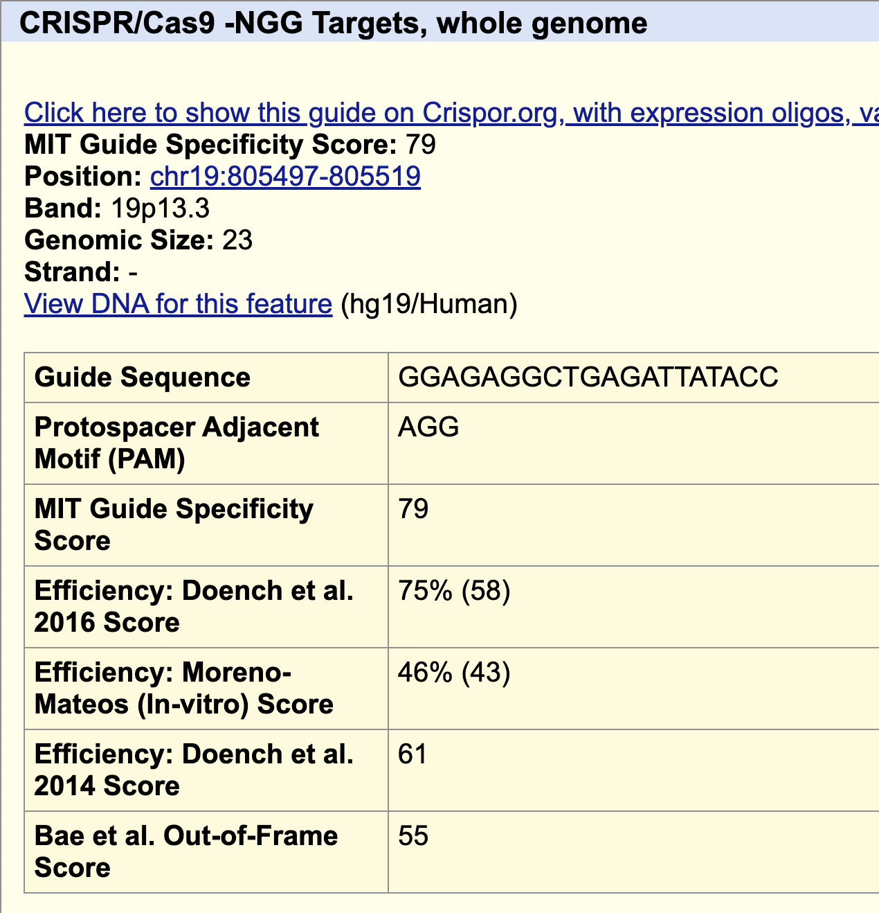

# BME 237 Problem Set 5: RNAi and CRISPR sgRNA scoring
- aedaivds@ucsc.edu
- 5/12/21

My lab is interested in understanding the functional consequences of alternative splicing. For example, we have identified alternative splicing changes associated with mutations in the splicing factor, U2AF1, which is frequently mutated in lung cancer and certain leukemias. Through RNA-Seq analysis, we can identify alternative splicing changes, transcriptome-wide. However, we do not understand if or how these splicing changes might change the function of these target genes. You can use this paper as a reference, but it is not necessary for this problem set: https://journals.plos.org/plosone/article?id=10.1371/journal.pone.0087361

One of the genes affected by U2AF1 mutation is CTNNB1 (Beta-catenin), which is a well-characterized cancer driver. U2AF1 mutations cause a change in alternative 3' splice site usage in the 3' UTR of CTNNB1, which results in a longer 3' UTR. We hypothesize that this longer 3' UTR will change the regulation of CTNNB1 due to additional miRNA binding sites that are present. We will start to test this hypothesis by using miRNA target prediction to find possible miRNAs that bind in this longer 3' UTR.

Another gene affected by U2AF1 mutation is PTBP1 (which is, itself, a splicing factor). U2AF1 mutations cause skipping of an exon in PTBP1. We would like to experimentally test the downstream consequences of causing exon skipping in PTBP1 by designing sgRNAs that would direct Cas9 to cut close to either splice site of the exon. Repairing the cut through non-homologous end joining may create mutations at the splice site, which would then cause exon skipping.

## q1

To find possible miRNAs that specifically target the CTNNB1 3'UTR isoform associated with U2AF1 mutation, we will use TargetScan (Links to an external site.).

TargetScan has three different 3'UTRs deriving from annotated transcripts of CTNNB1 that are used in their database:

- ENST00000349496.5 (expressed at a low level. Can disregard)
- ENST00000396185.3 (upregulated with U2AF1 mutation. Longer 3'UTR than ENST00000396183.3)
- ENST00000396183.3 (more highly expressed in wild-type conditions. Downregulated with the U2AF1 mutation. Shorter 3' UTR than ENST00000396185.3)

Use TargetScan to identify at least one miRNA that would target the 3'UTR of ENST00000396185.3, but not ENST00000396183.3. These are potential miRNA target sites that we can test to see if they affect CTNNB1 gene regulation in follow-up experiments.

The miRNA is case-sensitive. For example, please give the name as miR-XX-XXX. If the miRNA has an additional version number, please include, e.g. miR-XX-XXX.2

TargetScan provides links to a UCSC Genome Browser view of the miRNA target sites on the transcripts. This might be helpful. Look for a link that says "[View human genome browser (hg19)]"

### q1 Answer
miR-139-5p and miR-142-3p.2
[target scan](http://www.targetscan.org/vert_72/)

#### step 1  Target scan home page. Enter the gene we are interested in 'CTNNB1'

#### step 2  Submit

#### step 3select track ENST00000396185.3
Notice the arrow points to a link to the UCSC Genome browser

#### step 4 UCSC Genome browser

#### step 5 zoom in and scroll
I think this is the 3x view. I scrolled left a single step a couple of time. Notic the arrow shows how the micro rna maps

## q2

The UCSC Genome Browser contains a track called "CRISPR Targets", which is based on the CRISPOR tool. We will use this to design our sgRNAs to target near either splice site of the PTBP1 exon.

The PTBP1 exon coordinate is chr19:805,492-805,569 (hg19).

What is one possible good sgRNA to select. These would be sequences colored green, indicating "high predicted cleavage". Please provide the guide sequence.

### q2 answer
GGAGAGGCTGAGATTATACC

UCSC Genome Browser after entering coordinates

#### step 2 select CRISPR Targets
scroll down or search. make sure the track is not hidden. Make sure you press the refresh button

#### step 3 click on one of the green CRISPR track

#### step 4 our guide sequence

